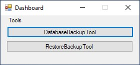
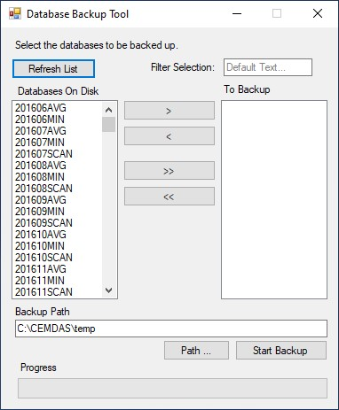
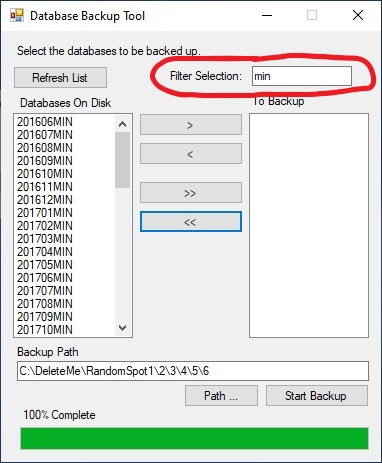
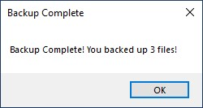
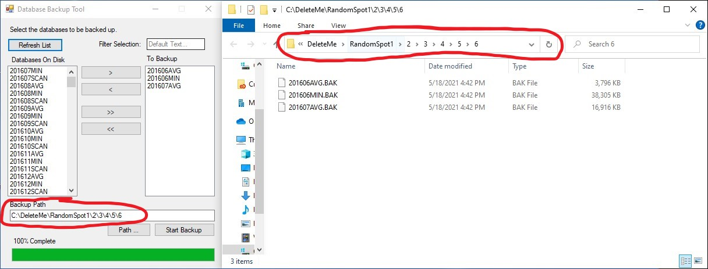
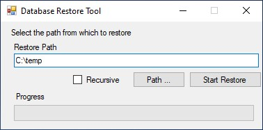

# Database Backup and Restore Tool

#### Installation
Visit the Build folder of the GitHub repo and download **DatabaseBackupTool.exe**, as well as **SqlConnector.dll**

#### Running the program
With the two files listed above in the same folder, double clicking the executable will bring up the following menu

## Backup tool

(NEW!) A filter text box to filter the contents of "On Disk Databases". Simply type into the filter text box and click Refresh or Enter on the keyboard to apply the filter.

   

All active databases are listed in the left column. Highlight any databases to be backed up and move them to the right column (see **buttons** section). Once the desired database names are located under the "To Backup" list, select a  backup location. Locations can by typed by hand, pasted in, or selected using the **Path ...** button. **NOTE: if the selected backup location doesn't exist, it will be created upon clicking "Start Backup"** To start the backup process click "Start Backup". Time to complete will vary heavily based on the size and number of databases being backed up.  

### Buttons
* ">" : Move highlighted "On Disk Databases" items to the "To Backup" list
* "<" : Move highlighted "To Backup" items to the "On Disk Databases" list
* ">>" : Move *all* items to the "To Backup" list
* "<<" : Move *all* items to the "On Disk Databases" list
* "Refresh" : Refreshes the database and applies any filter typed into the filter box
* "Path ..." : Opens the traditional windows explorer to navigate to the desired location
* "Start Backup" : Starts the backup process

Upon completion of the backup process a success message box pops up:    

(NEW!) Clicking OK closes the pop up and opens the backup location in file explorer.

## Restore tool

(NEW!) This utility can now bulk restore databases as well! From the dashboard, selecting RestoreBackup Tool will open the following form:  

 

Step one is to select a path. Just like with the backup tool, this can be typed by hand, pasted, or selected using the **Path ...** button. If the path is invalid, or it cannot  be accessed by this program, the Restore Path box will be highlighted in RED.  
If backup files reside inside many different sub folders, click the Recursive check box and set restore path to the parent folder. The restore tool will then open every sub folder when searching for .bak files

## Under the hood
To improve speed this utility is now multi threaded on both the backup and the restore functions.  
Multi threaded restore sometimes caused issues where databases would be *stuck* in the restoring state. To remedy this, once all the threads finish restoring, a single thread then goes back and checks to see if any were stuck in restoring attempts to restore any that are stuck (now single threaded to aid in successful restoration)  

# Developing

## Contributing
Pull requests are welcome. For major changes, please open an issue first to discuss what you would like to change.

## License
[MIT](https://choosealicense.com/licenses/mit/)
